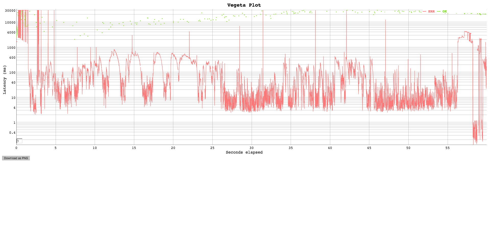

# Golangの同時関数呼び出しを１回で済ませられるライブラリ 「SingleFlight」 が便利

## tl;dr
- 高頻度に叩かれがちな重めの取得系関数呼び出しは[SingleFlight](https://godoc.org/github.com/golang/groupcache/singleflight) を使おう！

## 動機
- Cacheが切れた途端Mysqlに大量のアクセスが流れ込み、LAが上がる現象をどう回避しようか考えていたときに、[SingleFlight](https://godoc.org/github.com/golang/groupcache/singleflight) というライブラリを見つけたため使えるか計測してみた。

## SingleFlightって何？
- 複数人が同じ関数呼び出しを同時にした場合、最初の１人だけ関数を実行し、残りの人は、最初の人が実行した関数呼び出しが終了するまで待機し、最初の１人が関数呼び出しの結果を取得したら、待機してる残りの人に結果をシェアしてくれる。
- Golangからリソースへのアクセスが同時に行われても、１本だけでよくなるから嬉しい。効率的。
- もちろんイミュータブルな関数じゃないと使えない。

## 計測環境
### 計測対象
- 3本のMysqlQueryを叩き、合計が500ms位かかるGolangAPI

### 計測ツール
- [vegeta](https://github.com/tsenart/vegeta)

### 計測コマンド
- 秒間100リクエスト を１分間 (叩きすぎかな?)
```
echo "GET http://localhost:1323/hoge" | vegeta attack -duration=1m -rate=100 | vegeta report -reporter=plot > plot.html
```

### 計測パターン
1. そのまま
2. 10秒毎で切れるMemCache を挟む
3. SingleFlight を挟む
4. 10秒毎で切れるMemCache + SingleFlight を挟む 

## 計測結果
1. そのまま
	- ほぼ全部500。普通にやると耐えられない。


2. 10秒毎で切れるMemCache を挟む
	- キャッシュが切れた途端、Mysql,Memcacheが落ちてしまい、それ以降は全て500に。


3. SingleFlight を挟む
	- リクエスト毎にレイテンシに差が出てしまうが、正しく200で返せる


4. 10秒毎で切れるMemCache + SingleFlight を挟む 
	- キャッシュが切れてセットされるまでの間も、正しく200で返せる


## 結論
- 重めのMysqlを叩く + 高頻度リクエスト => SingleFlightは必須。